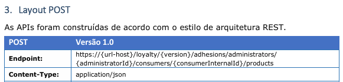
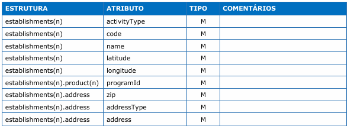
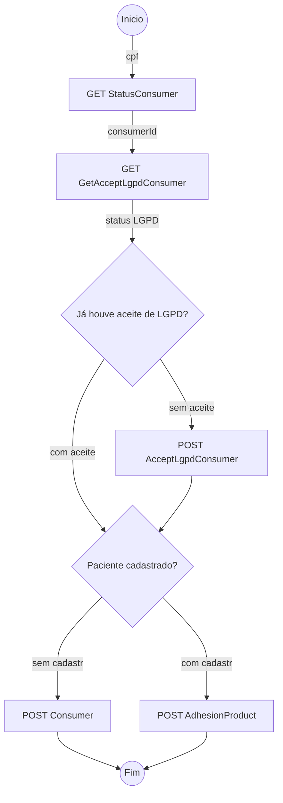

# BiolabIntegraVida - Documentação
Escrito por Vinicius Quinafelex Alves<br/>Versão 1.1 (31/01/2025)

## Sumário

- <a href="#resumo">Resumo</a>
- <a href="#ip-autenticacao">InterPlayers Loyalty - Autenticação</a>
- <a href="#ip-api">InterPlayers - Consumindo API</a>
- <a href="#ip-documentacao">InterPlayers - Interpretando a documentação</a>
    - <a href="#ip-documentacao-endpoint">Endpoints</a>
    - <a href="ip-documentacao-retorno">Tipos de retorno</a>
    - <a href="ip-documentacao-dados">Estrutura de dados</a>
- <a href="#ip-adesao">InterPlayers - Fluxo de adesão</a>

## <a id="resumo">Resumo</a>
Este documento tem como objetivo explicar elementos do sistema e formato de integração com o sistema da InterPlayers.

O projeto foi desenvolvido em .NET Core 8.0, e utilizando tecnologia ASP.NET MVC.

O sistema utiliza a estratégia de SSR (server-side rendering), retornando HTMLs completos para a tela, facilitando o processo de SEO.

Determinados dados de uso comum são armazenados em cache em memória, expirando após alguns minutos. Apesar do ganho de performance e menor sobrecarga nos sistemas de integração, é importante levar isso em consideração em momentos de manutenção.

Contém um projeto de testes de integração com o sistema da InterPlayers para validar formatos e mecanismos de autenticação. Os testes são idempotentes e podem ser rodados a qualquer momento, apesar de fugir do modelo de "um asserção por teste".

Contém uma arquivo `Dockerfile` para publicação de imagens em conteinters, se desejado.

## <a id="ip-autenticacao">InterPlayers Loyalty - Autenticação</a>
Tokens de autenticação devem ser gerados enviando requisições HTTP REST ao servidor AD B2C.

Atualmente o ambiente de desenvolvimento não permite emitir tokens via MSAL.

> POST <url_autority>

```json
// Payload
{
    "grant_type": "client_credentials",
    "client_id": "<client_id>",
    "client_secret": "<client_secret>",
    "scope": "<scope>" }
}
```

Os dados de `url_autority`, `client_id`, `client_secret` e `scope` devem ser informados pela InterPlayers. Cada ambiente (desenvolvimento, homologação ou produção) tem dados diferentes.

Exemplo de ambiente de desenvolvimento
Dado | Formato | Valor
-- | -- | -- 
url_authority | URL | https://interplayersdevb2c.b2clogin.com/interplayersdevb2c.onmicrosoft.com/B2C_1_Loyalty/oauth2/v2.0/token
scope | URL | https://interplayersdevb2c.onmicrosoft.com/services/loyalty-api/.default
client_id | Guid |
client_secret | String aleatória |

## <a id="ip-api">InterPlayers - Consumindo API</a>
Um único token JWT pode ser reutilizado em várias requisições, respeitando o tempo limite do token.

O token JWT deve ser passado no cabeçalho de todas as requisições para o sistema da InterPlayers.

```
Authorization: Bearer <access_token>
```

Para utilizar os endpoints, é recomendado consultar a documentação oficial.

Para referência, abaixo está uma relação de links utilizados para se conectar com o ambiente de desenvolvimento.

Os dados entre colchetes devem ser substituídos pelo dado adequado. `administratorId` é um dado fixo por indústria, que deve ser informado pela InterPlayers, enquanto os demais dependem do contexto da requisição.

Tipo de consulta | URL
-- | --
Consultar UF | https://idp-api-gtw.azure-api.net/external-loyalty-logistic-pre/v1/addressData/administrators/{administratorId}/ufs
Consultar medicamentos | https://idp-api-gtw.azure-api.net/external-loyalty-products-pre/v1/Product/administrators/{administratorId}/products
Consultar estabelecimentos | https://idp-api-gtw.azure-api.net/external-loyalty-store-pre/v2/Establishment/administrators/{administratorId}/types/MH/establishments?zip={zip}
Consultar profissional | https://idp-api-gtw.azure-api.net/external-loyalty-professionals-pre/v1/Professional/administrators/{administratorId}/professionals/{crm}/{uf}
Consultar paciente/consumidor | https://idp-api-gtw.azure-api.net/external-loyalty-registration-pre/v1/registrations/administrators/{administratorId}/consumers/status?personNumber={cpf}
Consultar status LGPD | https://idp-api-gtw.azure-api.net/external-loyalty-registration-pre/v2/Registrations/administrators/{administratorId}/consumers/{userId}/accept-term
Aceitar LGPD | https://idp-api-gtw.azure-api.net/external-loyalty-registration-pre/v1/Registrations/administrators/{administratorId}/consumers/{userId}/accept-term
Cadastrar paciente/consumidor | https://idp-api-gtw.azure-api.net/external-loyalty-registration-pre/v1/Registrations/administrators/{administratorId}/consumers
Aderir a produto | https://idp-api-gtw.azure-api.net/external-loyalty-adhesion-pre/v1/Adhesion/administrators/{administratorId}/consumers/{userId}/products

## <a id="ip-documentacao">InterPlayers - Interpretando a documentação</a>

### <a id="ip-documentacao-endpoint">Endpoints</a>


O method é especificado em cima da tabela (GET ou POST).

A URL documentada é uma referência, mas dados exibidos como fixos, por exemplo `/loyalty/`, podem ser alterados de acordo com o subsistema interno ou ambiente utilizado.

O atributo `version` não é especificado no documento e não tem relação com a versão que está no nome do PDF.

É recomendado solicitar para a InterPlayers a URL completa de todos os endpoints relevantes para os casos de uso trabalhados.

Vale reforçar que `{url-host}`, `/loyalty/` e outros atributos podem ser diferentes dependendo do ambiente (dev/homolog/produção), e todos devem ser levantados individualmente.

### <a id="ip-documentacao-dados">Estrutura de dados</a>


Explicando a estrutura documentada acima, extraída do documento `07. Manual Técnico - ListEstablishment - v5.0.pdf`:

Atributos seguidos com indicação de lista `(n)` indica que aquele atributo é uma lista.

Atributos sem indicação de lista `(n)` indica que o atributo é um objeto simples.

Todos os atributos listados no mesmo nível do objeto estão dentro do mesmo objeto.

A documentação não trás informações sobre o tipo de dado dos atributos, e o mesmo dado pode ter formados diferentes (`long`, `string` ou outro) dependendo do endpoint invocado. Cada caso deve ter testado individualmente.

Exemplo de JSON baseado na estrutura acima:
```json
{
    "establishments": [
        {
            "activityType": "<string>",
            "code": "<string>",
            "name": "<string>",
            "latitude": "<string>",
            "longitude": "<string>",
            "product": [
                {
                    "programId": "<string>"
                }
            ],
            "address": {
                "zip": "<string>",
                "addressType": "<string>",
                "address": "<string>",
            }
        },
    ]
}
```

### <a id="ip-documentacao-retorno">Tipos de retorno</a>
Determinados endpoints retornam `StatusCode 200` e outros `StatusCode 204`. `StatusCode 204` não tem conteúdo de response.

Diferente da documentação, o retorno `StatusCode 400` está dentro de um objeto `data`, como no exemplo abaixo. Dependendo do endpoint, este atributo pode vir com caixa baixa (`data`) ou alta (`Data`), então é recomendado realizar uma deserialização com caso insensitivo.

```json
{
    "data": {
        "error": "<string>",
        "errorDescription": "<string>",
    }
}
```

O atributo `error` contém o código identificador de erro, e nem todos os códigos de erro retornam descrições. Para este projeto, não foi fornecido uma lista de códigos de erro, porém deveria ser fornecido pela InterPlayers.

## <a id="ip-adesao">InterPlayers - Fluxo de adesão</a>



### GET StatusConsumer
Busca o consumerId dentro do sistema da InterPlayers.

É garantido que o endpoint retornará um consumerId associado ao CPF, pois esta operação ativamente cria um novo consumerId caso ainda não exista.

Caso o cadastro do usuário ainda não tenha sido realizado, o endpoint retornará o valor `NE` no atributo `status`. O endpoint continuará retornando este valor até que seja executado um `POST Consumer` para concluir o cadastro do usuário.

### GET GetAcceptLgpdConsumer
Retorna uma mensagem de erro com código `LR06` caso o consumidor não tenha realizado um aceite de LGPD.

### POST Consumer
Não pode ser chamado se o usuário já constar na base de dados, caso contrário retornará um erro.

Não é possível registrar o consumidor antes do aceite da LGPD, pois há um bloqueio no sistema da InterPlayers.